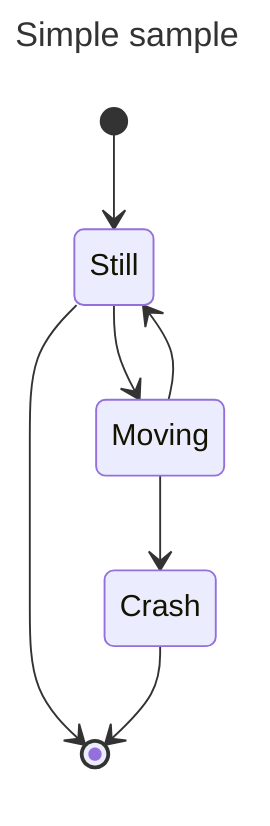

&nbsp;

<SwmSnippet path="/CONTRIBUTING.md" line="4">

---

ask ai

```markdown
Unit tests
--------------------
Activiti uses now [AssertJ](http://joel-costigliola.github.io/assertj/assertj-core-features-highlight.html)
as alternative to default JUnit assertions. This makes tests more readable and provides clearer failure messages.
Please, make sure that you are using `AssertJ` assertions for every new test.
I.e.
* `assertThat(myBoolean).isTrue();` instead of `assertTrue(myBoolean);`
* `assertThat(actual).isEqualTo(expected);` instead of `assertEquals(expected, actual);`
* `assertThat(myList).containsExactly("a", "b", "c");` instead of `assertTrue(myList.contains("a", "b", "c"));`

Branches naming convention
--------------------------
If you are creating branches directly in the [main repository](https://github.com/Activiti/Activiti), this is
 the naming convention to be used for branches:
 - `username-issueNumber-anythingYouWant`

```

---

</SwmSnippet>

&nbsp;

<SwmSnippet path="/activiti-core/activiti-spring-conformance-tests/activiti-spring-conformance-set0/src/test/java/org/activiti/spring/conformance/set0/Application.java" line="21">

---

| ls |   |   |
| -- | - | - |
|    |   |   |
|    |   |   |

```java
@SpringBootApplication
public class Application {

    public static void main(String[] args) {
        SpringApplication.run(Application.class);
    }

}
```

---

</SwmSnippet>

<SwmSnippet path="/activiti-core/activiti-api-impl/activiti-api-process-runtime-impl/src/test/resources/task-variable-mapping-extensions.json" line="19">

---

other

```json
        },
        "process-variable-inputmap-2-id": {
          "id": "process-variable-inputmap-2-id",
          "name": "process_constant_inputmap_2",
          "type": "string",
          "required": true,
          "value": "inputmap2Value"
        },
```

---

</SwmSnippet>

<SwmSnippet path="/checkstyle-rules.xml" line="3">

---

rules

```xml
    "-//Checkstyle//DTD Checkstyle Configuration 1.3//EN"
```

---

</SwmSnippet>

<SwmSnippet path="/checkstyle-rules.xml" line="14">

---

&nbsp;

```xml

    Authors: Max Vetrenko, Ruslan Diachenko, Roman Ivanov.
 -->

<module name = "Checker">
  <module name="FileTabCharacter">
    <property name="fileExtensions" value="java,xml"/>
  </module>
  <!-- Excludes all 'module-info.java' files              -->
  <!-- See https://checkstyle.org/config_filefilters.html -->
  <module name="BeforeExecutionExclusionFileFilter">
    <property name="fileNamePattern" value="module\-info\.java$"/>
  </module>
  <!-- Checks for whitespace                               -->
  <!-- See http://checkstyle.sf.net/config_whitespace.html -->
  <module name="FileTabCharacter">
    <property name="eachLine" value="true"/>
  </module>

  <module name="TreeWalker">
```

---

</SwmSnippet>

<SwmSnippet path="/settings.xml" line="4">

---



```xml
  <servers>
    <server>
      <id>alfresco</id>
      <username>${env.MAVEN_USERNAME}</username>
      <password>${env.MAVEN_PASSWORD}</password>
    </server>
    <server>
      <id>central</id>
      <username>${env.MAVEN_USERNAME}</username>
      <password>${env.MAVEN_PASSWORD}</password>
    </server>
  </servers>
```

---

</SwmSnippet>

<SwmMeta version="3.0.0" repo-id="Z2l0aHViJTNBJTNBQWN0aXZpdGklM0ElM0FTaGFuZURlYW4=" repo-name="Activiti"><sup>Powered by [Swimm](https://app.swimm.io/)</sup></SwmMeta>
